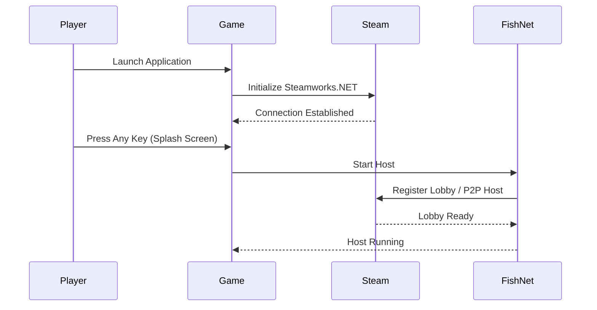

# Hosting Sequence (something like it):

```mermaid
sequenceDiagram
    participant Player
    participant Game
    participant Steam
    participant FishNet

    Player->>Game: Launch Application
    Game->>Steam: Initialize Steamworks.NET
    Steam-->>Game: Connection Established

    Player->>Game: Press Any Key (Splash Screen)

    Game->>FishNet: Start Host
    FishNet->>Steam: Register Lobby / P2P Host
    Steam-->>FishNet: Lobby Ready

    FishNet-->>Game: Host Running
```