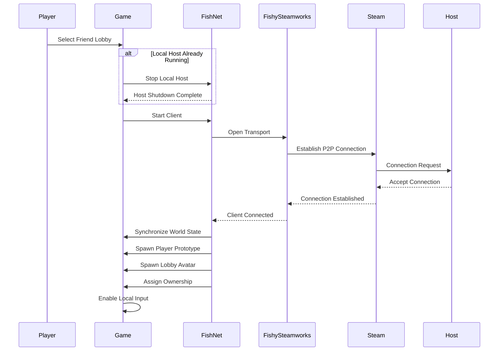

# Joining Sequence (something like it):

```mermaid
sequenceDiagram
    participant Player
    participant Game
    participant FishNet
    participant FishySteamworks
    participant Steam
    participant Host

    Player->>Game: Select Friend Lobby

    alt Local Host Already Running
        Game->>FishNet: Stop Local Host
        FishNet-->>Game: Host Shutdown Complete
    end

    Game->>FishNet: Start Client

    FishNet->>FishySteamworks: Open Transport
    FishySteamworks->>Steam: Establish P2P Connection
    Steam->>Host: Connection Request

    Host-->>Steam: Accept Connection
    Steam-->>FishySteamworks: Connection Established
    FishySteamworks-->>FishNet: Client Connected

    FishNet->>Game: Synchronize World State

    FishNet->>Game: Spawn Player Prototype
    FishNet->>Game: Spawn Lobby Avatar

    FishNet->>Game: Assign Ownership

    Game->>Game: Enable Local Input
```