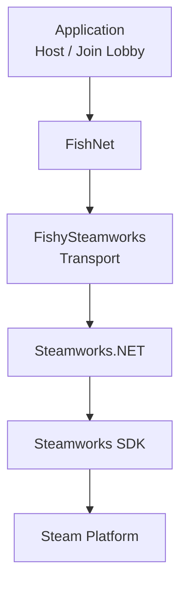

# Networking stack (something like it):

```mermaid
flowchart TD

    A[Application<br/>Host / Join Lobby]
        --> B[FishNet]

    B --> C[FishySteamworks<br/>Transport]

    C --> D[Steamworks.NET]

    D --> E[Steamworks SDK]

    E --> F[Steam Platform]
```