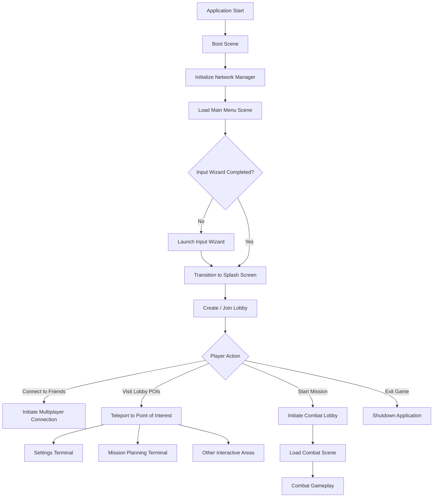

# Overall architecture (something like it):

```mermaid
flowchart TD

    A[Application Start]
    --> B[Boot Scene]

    B --> C[Initialize Network Manager]

    C --> D[Load Main Menu Scene]

    D --> E{Input Wizard Completed?}

    %% First launch
    E -- No --> F[Launch Input Wizard]
    F --> G[Transition to Splash Screen]

    %% Returning player
    E -- Yes --> G

    %% Splash
    G --> H[Create / Join Lobby]

    %% Lobby Hub
    H --> I{Player Action}

    %% Branch A
    I -->|Connect to Friends| J[Initiate Multiplayer Connection]

    %% Branch B
    I -->|Visit Lobby POIs| K[Teleport to Point of Interest]

    K --> K1[Settings Terminal]
    K --> K2[Mission Planning Terminal]
    K --> K3[Other Interactive Areas]

    %% Branch C
    I -->|Start Mission| L[Initiate Combat Lobby]

    L --> M[Load Combat Scene]
    M --> N[Combat Gameplay]

    %% Branch D
    I -->|Exit Game| O[Shutdown Application]
```