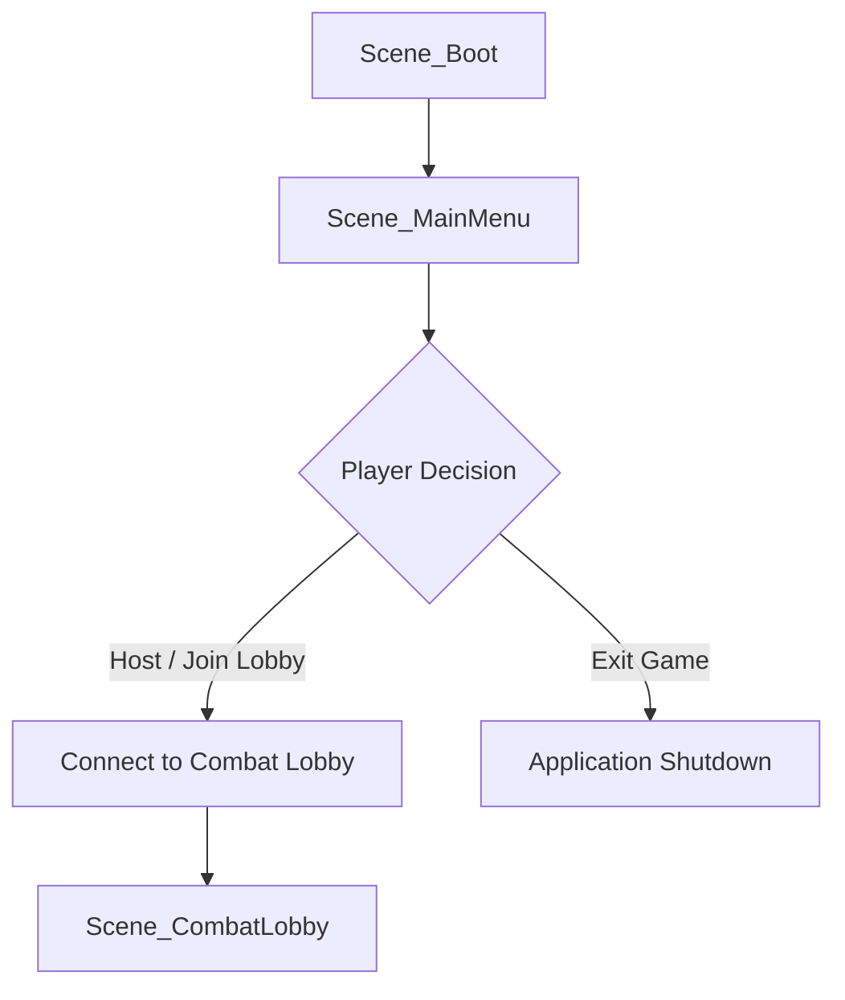

# Scenes architecture (something like it):

```mermaid
flowchart TD

    A[Scene_Boot]

    A --> B[Scene_MainMenu]

    B --> C{Player Decision}

    C -->|Host / Join Lobby| D[Connect to Combat Lobby]

    D --> E[Scene_CombatLobby]

    C -->|Exit Game| F[Application Shutdown]
```