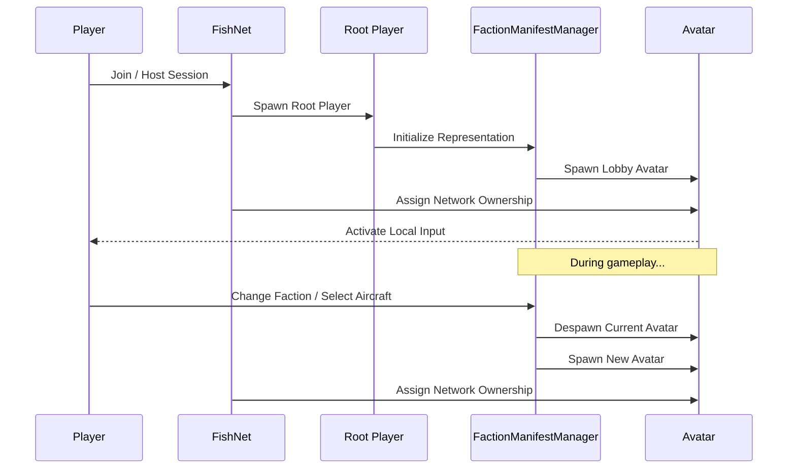

# Spawn sequence (something like it):

```mermaid
sequenceDiagram
    participant Player
    participant FishNet
    participant Root as Root Player
    participant Manifest as FactionManifestManager
    participant Avatar

    Player->>FishNet: Join / Host Session

    FishNet->>Root: Spawn Root Player
    Root->>Manifest: Initialize Representation

    Manifest->>Avatar: Spawn Lobby Avatar
    FishNet->>Avatar: Assign Network Ownership

    Avatar-->>Player: Activate Local Input

    Note over Manifest,Avatar: During gameplay...

    Player->>Manifest: Change Faction / Select Aircraft
    Manifest->>Avatar: Despawn Current Avatar
    Manifest->>Avatar: Spawn New Avatar
    FishNet->>Avatar: Assign Network Ownership
```